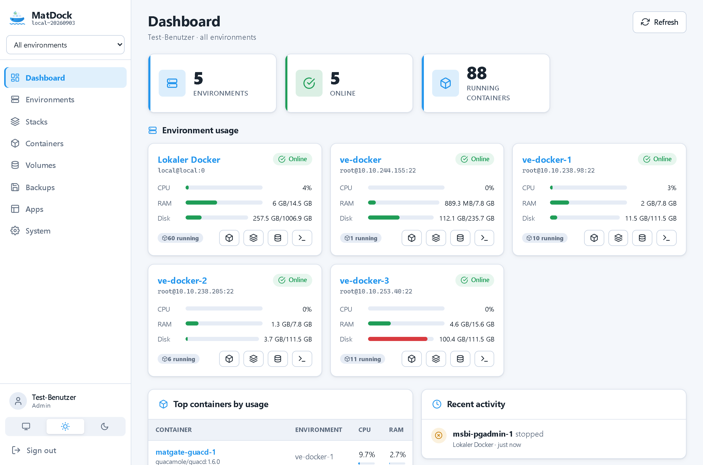
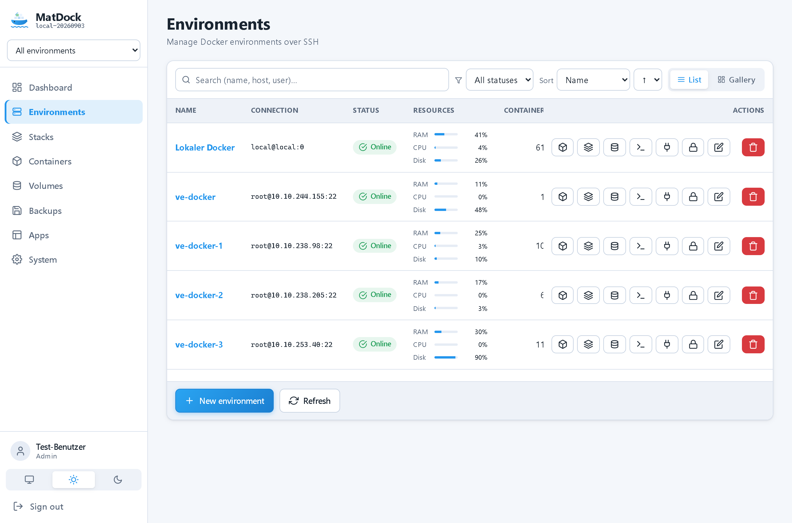
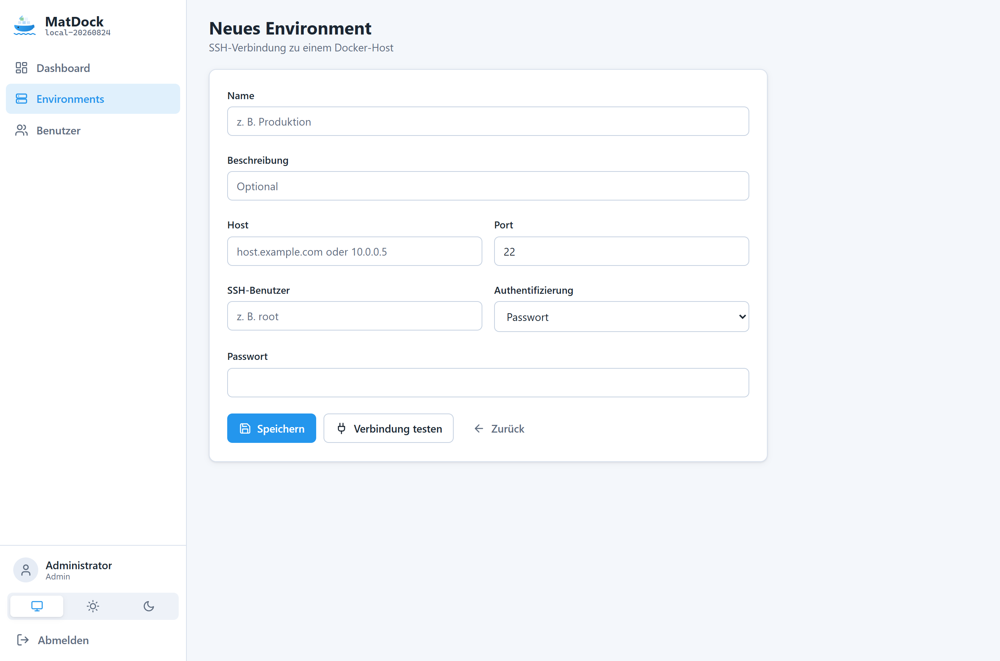
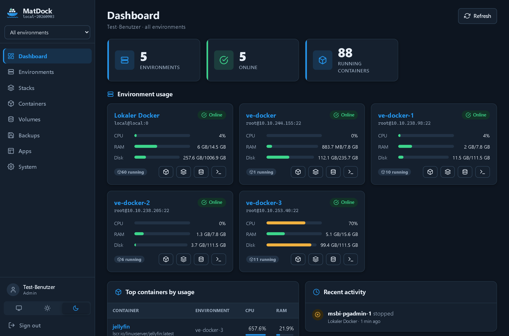
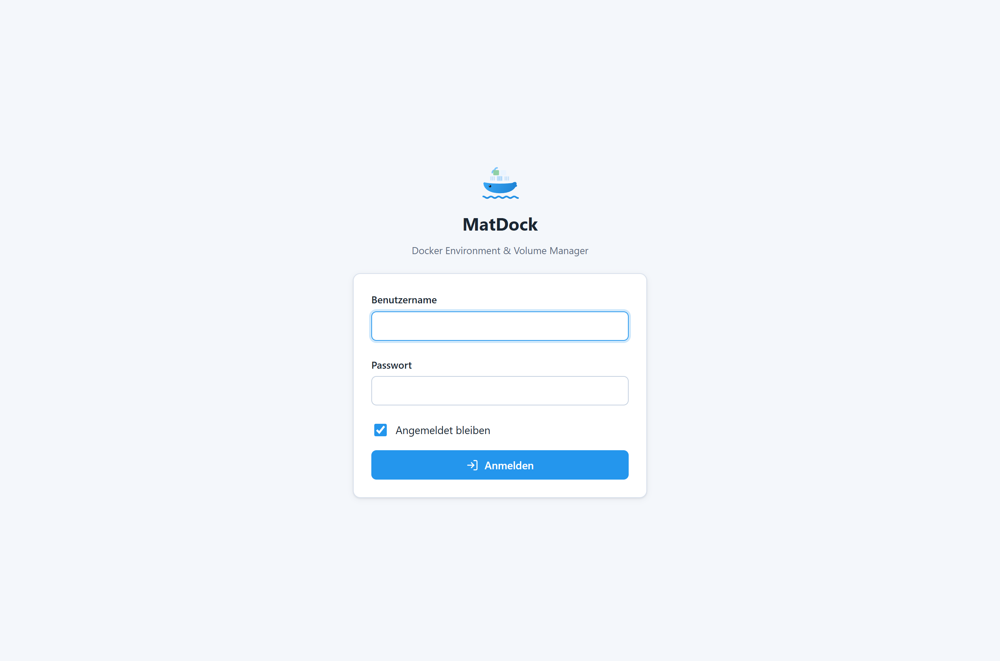
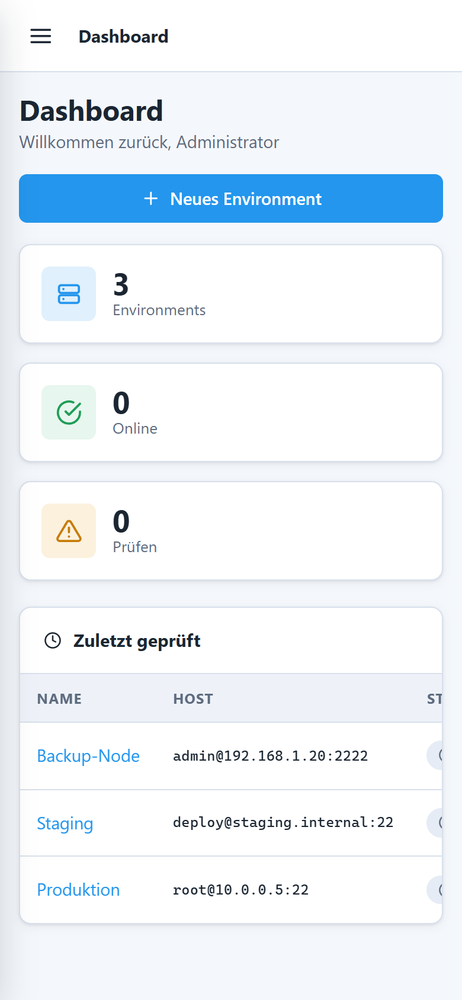

<h1 align="center">
  <br>
  MatDock
</h1>

<p align="center"><em>Docker Environment &amp; Volume Manager – eine schlanke Alternative zu Portainer/Dockhand mit Fokus auf Environment- und Volume-Verwaltung.</em></p>

---

## Was ist MatDock?

MatDock verbindet sich per **SSH** mit mehreren Docker-Hosts (Environments) und macht deren
Volumes verwaltbar. Der Fokus liegt auf dem **Verschieben von Volumes zwischen Umgebungen** sowie
(geplant) auf **Backup-Plänen** mit Retention, Zeitplänen und Restore.

**Build 1 (Fundament + Environments)** umfasst:

- 🔐 Lokale Anmeldung, Rollen (Admin / User / Anonym), server-seitige Sessions (überstehen Container-Neustart)
- 🖥️ Environment-Verwaltung: SSH-Hosts anlegen/bearbeiten, **Verbindung testen**
- 💾 Volumes eines Environments anzeigen (Basis für die spätere Migration)
- 👤 Benutzerverwaltung (Admin)
- 🎨 Eigenes UI-Designsystem (Dark/Hell/System), mobil-optimiert, wiederverwendbare Controls

**Geplant (nächste Meilensteine):** Volume-Migration A→B, Backup-Pläne, Retention, Zeitpläne/Scheduler,
Restore, Microsoft Entra ID, Anonym-Link-Freigaben.

## Screenshots

| Dashboard | Environments |
|-----------|--------------|
|  |  |

| Environment bearbeiten | Dark Mode |
|------------------------|-----------|
|  |  |

| Login | Mobil |
|-------|-------|
|  |  |

## Tech-Stack

| Bereich        | Technologie |
|----------------|-------------|
| Backend/UI     | ASP.NET Core 10 **Razor Pages** (C#) |
| Datenbank      | **SQLite** (Logik) + JSON (Config), EF Core 10 |
| SSH            | SSH.NET |
| Docker         | Docker-CLI über SSH (strukturierte `--format '{{json .}}'`-Ausgabe) |
| Secrets        | ASP.NET Core Data Protection (Schlüssel auf dem Datenvolume) |

## Schnellstart (Docker)

```bash
docker compose up -d --build
```

Danach: <http://localhost:4455> (Port **4455**).

Erste Anmeldung mit dem Seed-Admin (Passwort muss beim ersten Login geändert werden):

- Benutzer: `admin`
- Passwort: `admin`

> ⚠️ Ändere `MatDock__Admin__Password` in `docker-compose.yml` vor dem ersten Start.

### Dev-Stack (mit SQLite-Web-Viewer)

```bash
docker compose -f docker-compose.yml -f docker-compose.dev.yml up -d --build
```

- App: <http://localhost:4455>
- SQLite-Web: <http://localhost:8085>

### Live-Reload / Testen

Der Workflow ist bewusst einfach: Container neu bauen und Stack neu deployen.

```bash
./scripts/redeploy.ps1        # Release-Stack
./scripts/redeploy.ps1 -Dev   # Dev-Stack inkl. SQLite-Web
```

## Lokal entwickeln (ohne Docker)

```bash
dotnet run --project src/MatDock.Web
```

Läuft auf <http://localhost:4455>. Daten landen in `src/MatDock.Web/App_Data/`.

## Daten & Persistenz

Alles Veränderliche liegt unter dem Datenverzeichnis (im Container `/data`, als Volume gemountet):

```
/data
├── matdock.db            # SQLite (Users, Sessions, Environments)
├── config/               # JSON-Konfiguration
├── dataprotection-keys/  # Schlüssel (Cookies + verschlüsselte Secrets)
└── logs/
```

Dadurch bleiben **Sessions und verschlüsselte Zugangsdaten über Container-Neustarts hinweg erhalten**.

## Projektstruktur

```
src/MatDock.Core   Domain, Daten (EF Core), Services (Auth, SSH, Docker, Environments)
src/MatDock.Web    Razor Pages, UI-Controls (TagHelpers), wwwroot
tests/MatDock.Tests xUnit-Tests
Dockerfile, docker-compose*.yml
.github/workflows/build.yml
```

## Versionierung & CI

GitHub Actions (`.github/workflows/build.yml`) baut bei jedem Push **sowohl** ein Docker-Image
**als auch** eine self-contained **Windows-EXE** (`win-x64`, Single-File) und lädt sie als Artefakt hoch.

| Branch        | Kanal   | Versionsschema |
|---------------|---------|----------------|
| `main`        | release | `<major>.<minor>.<build>-<datum>` z. B. `0.1.42-20260825` |
| `dev`         | nightly | `nightly-<build>-<datum>` |
| lokal         | local   | `local-<datum>` |

`major`/`minor` stehen zentral in [`Directory.Build.props`](Directory.Build.props); `build` ist die
GitHub-Run-Nummer, `datum` das Build-Datum (UTC, `yyyyMMdd`).

## Tests

```bash
dotnet test
```

## Sicherheitshinweise

- **Initial-Admin `admin`/`admin`**: nur für den ersten Start; das Passwort **muss** beim ersten Login
  geändert werden. Vor dem Produktivstart `MatDock__Admin__Password` setzen.
- **TLS**: Der Container spricht intern HTTP (Port 4455). Für Produktion **TLS vorne terminieren**
  (Reverse Proxy). `X-Forwarded-Proto` wird ausgewertet, damit das Session-Cookie dann `Secure` ist.
- **Datenvolume** (`/data`) enthält die SQLite-DB, verschlüsselte SSH-Secrets und die
  Data-Protection-Schlüssel – als vertraulich behandeln und gesichert sichern.
- **Für spätere Meilensteine geplant**: Login-Rate-Limiting/Lockout, Verschlüsselung des
  Data-Protection-Keyrings at-rest, Absicherung des lokalen Docker-SSH-Proxys per Token.
