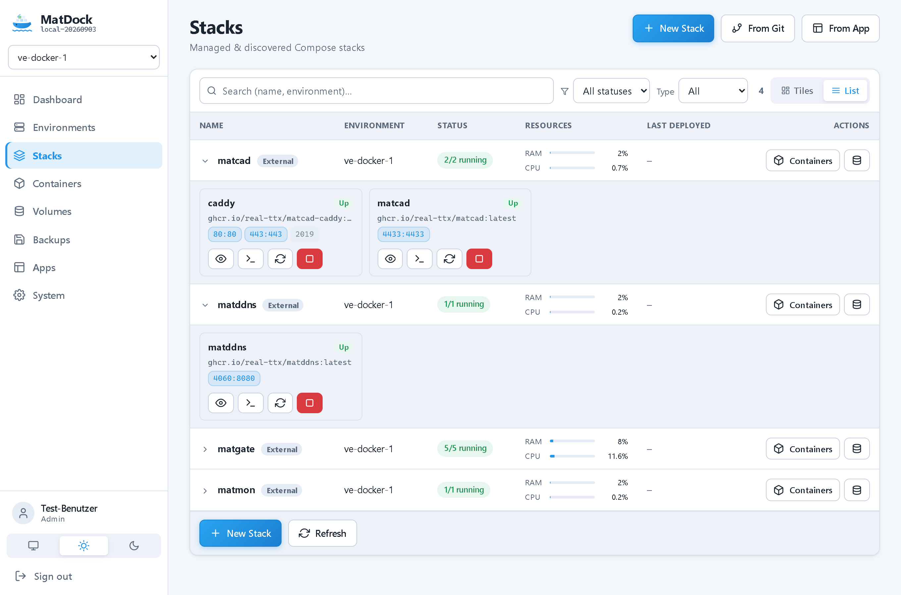
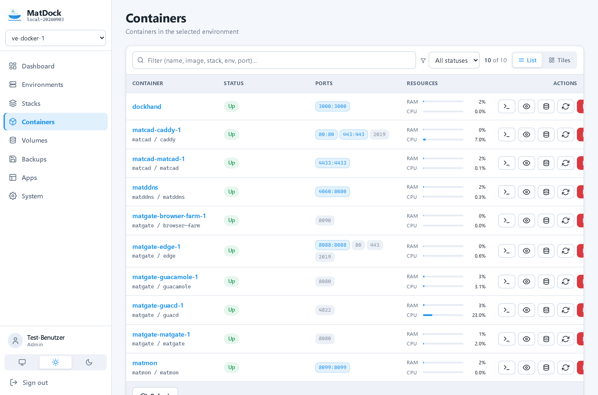
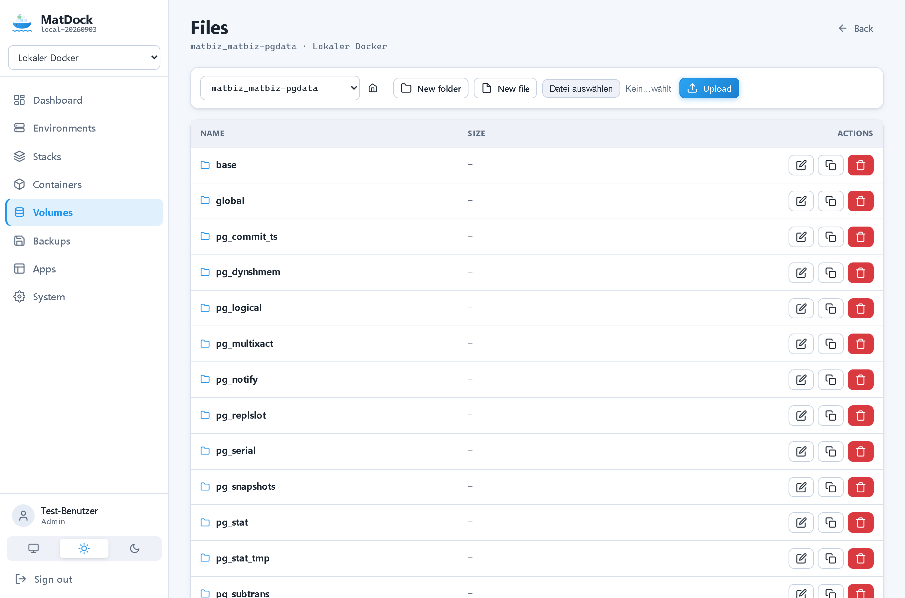
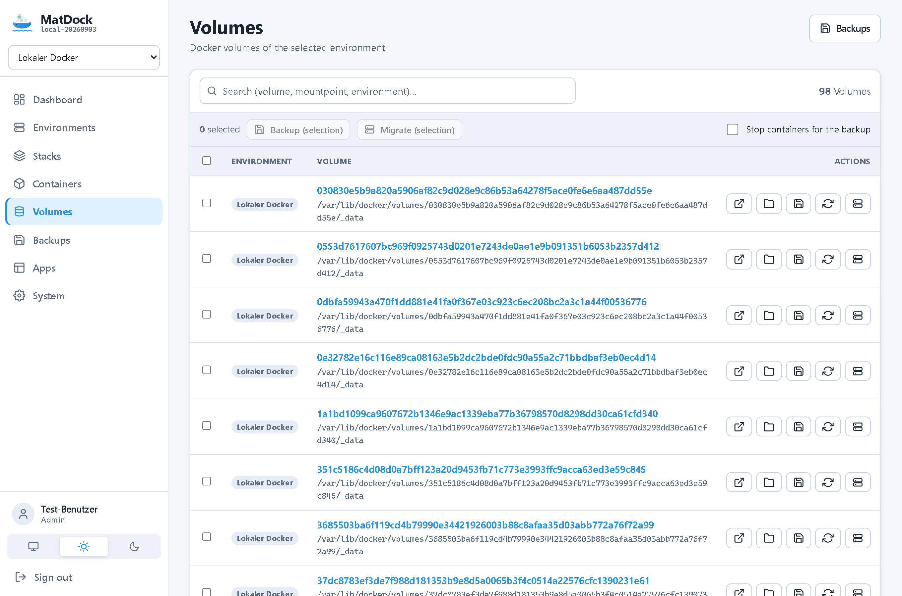
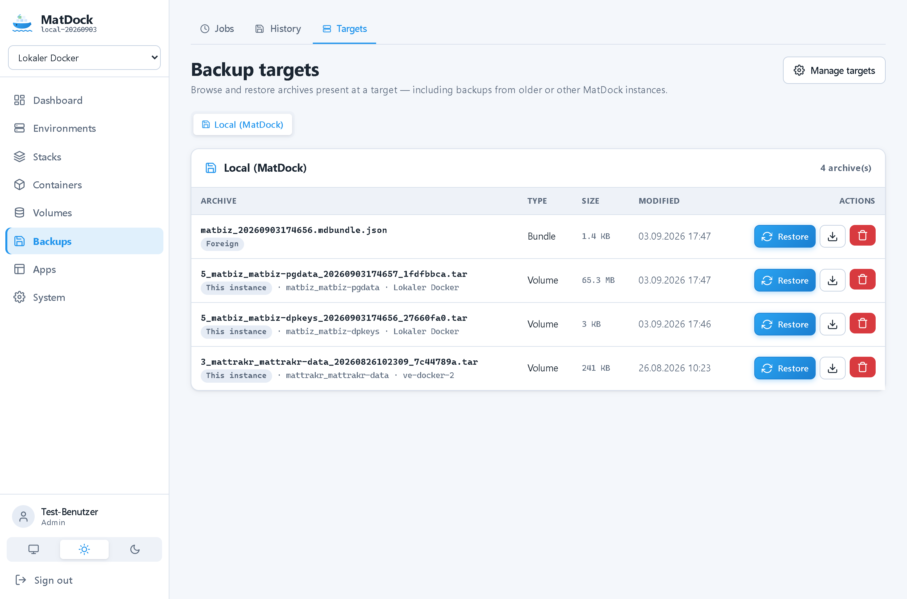
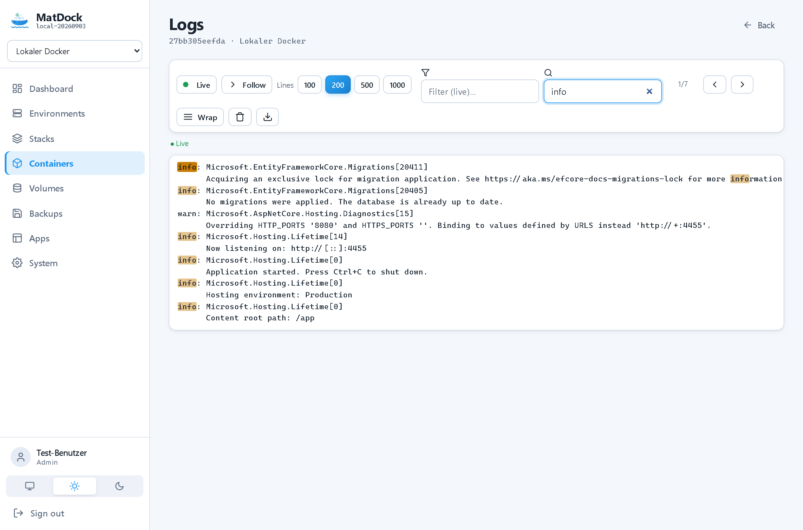
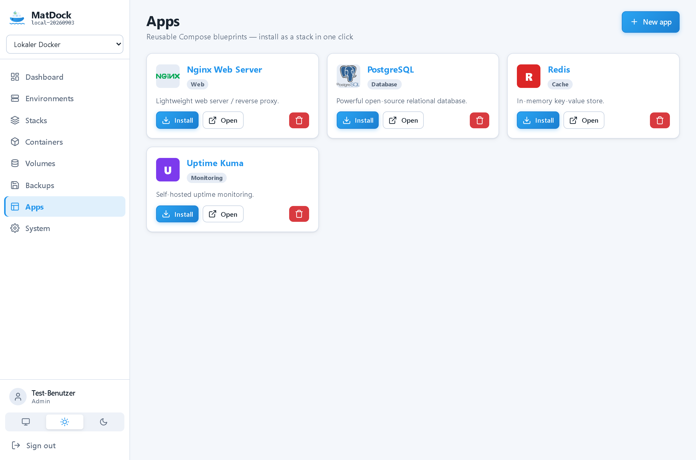
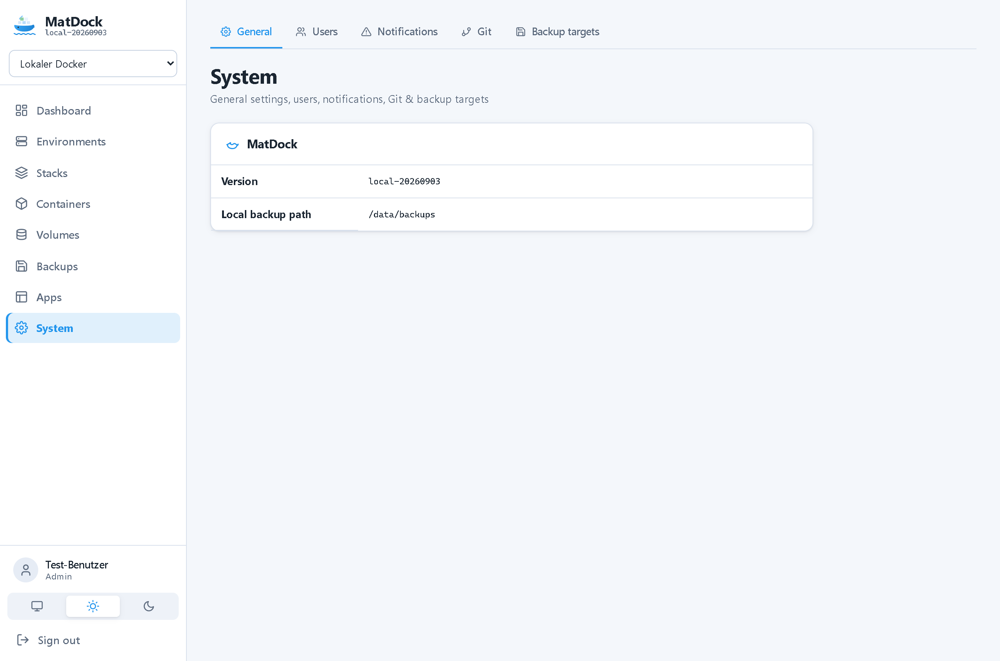
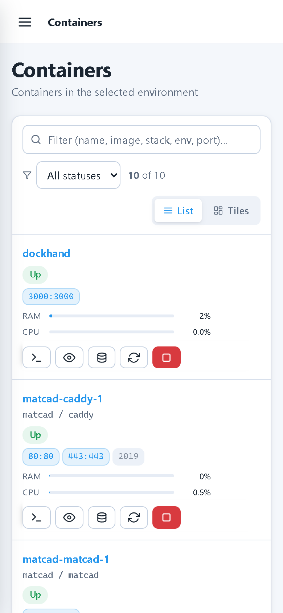
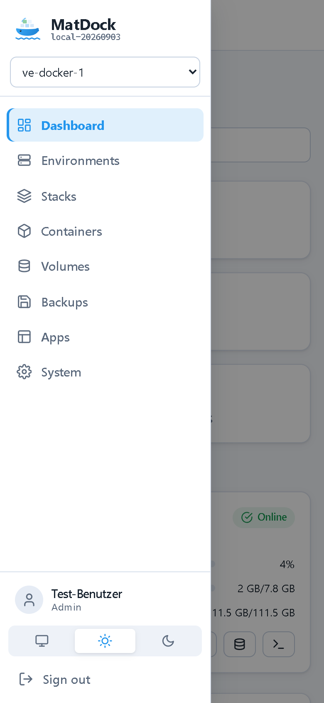

<div align="center">


# MatDock

**A Docker manager for your servers – in the browser.**

Environments over SSH or the local socket, stacks, containers, volumes, live logs, a web
terminal and real backups. One container, no cloud, no agents on the hosts.

</div>


---

## What this is about

Portainer and the like are great – but running many small servers means one agent per host,
another UI per box, and backups that are somebody else's problem. MatDock connects to your
hosts over plain **SSH** (or the **local Docker socket**) – nothing to install on the target –
and puts a single dashboard on top of all of them: stacks, containers, volumes, images and
live logs across every environment, with a global switcher to look at one host or **all at
once**. On top of that it does what most managers leave out: **volume migration between hosts**
and **scheduled, restorable backups** – single volumes or whole stacks.

## At a glance

**Environments**
- Connect over **SSH** (password or key) or the **local Docker socket** – no agent on the host
- **Host stats** per environment: CPU load, RAM and disk, running containers, Docker version
- A **global environment selector** in the sidebar – one host or **"All environments"**, every
  page follows it
- Connection test with a clear result; secrets stored **encrypted**

**Dashboard**
- Environment tiles with **CPU / RAM / disk** usage, **top containers** by load, a feed of
  recent **container events** (created / started / stopped) and the **backup status**

**Stacks & containers**
- **Managed and discovered** Compose stacks side by side – list or tiles, **expandable to the
  container cards** with per-service actions
- Add a stack from the **Compose editor**, from **Git**, or from an **App template**
- Deploy / redeploy / stop, aggregated **resources** per stack
- Container list with **short status** (hover for detail), **ports as clickable tags**, combined
  **CPU/RAM**, and actions: **open, shell, logs, volumes, start/stop/restart**

**Volumes**
- List across environments, **migrate a volume from one host to another** (tar over SSH)
- **File explorer** in the volume: browse, **edit text files**, image **preview**, **upload**,
  **download**, create folder/file, rename, duplicate, delete
- Create volumes, backup and restore

**Backups**
- **Scheduled jobs** (cron) with retention, plus a full **history**
- **Targets**: the local data volume or a **NAS via SMB** – browse the archives actually present
  at a target and **restore even backups written by another/older MatDock**
- **Full stack bundles**: all volumes **+ the compose definition + image references** in one
  backup, restored as a running stack (images are pulled again on restore)

**Operations**
- **Live log viewer** (streaming `docker logs -f`): pause, follow, **live filter**, **search**
- **Web terminal** (xterm.js) – a shell on the host or straight into a container
- **Apps**: reusable Compose blueprints with icons, installed as a stack in one click
- Users & roles, notifications (**SMTP + webhook**), Git credentials – all under **System**
- **Light and dark**, works well on **mobile**, no cloud and no third-party services

## Screenshots

### Stacks – expandable to the containers, with aggregated resources



Managed and discovered Compose projects in one list. A row expands to show its containers as
cards – each with status, ports and start/stop/restart/logs/shell – and the row itself sums up
the stack's CPU and RAM.

### Containers – status, ports and resources at a glance



Short status with the full text on hover, published ports as tags that open the app in a new
tab, and CPU + RAM as one compact column. Open, shell, logs, volumes and lifecycle actions per
row.

### Volumes: migration, backups and a file explorer

| File explorer | Volumes |
|---|---|
|  |  |

Browse a volume like a folder – edit, preview, upload and download – switch volumes from the
dropdown, or migrate a whole volume to another host.

### Backups you can actually restore



Every archive present at a target – including ones written by an older or a different MatDock
instance to the same NAS – ready to restore. Whole stacks are backed up as a bundle (volumes +
compose + image references) and come back as a running stack.

### Live logs



`docker logs -f` in the browser: follow, pause, filter to matching lines, and search with
highlighting and next/previous.

### Apps, environments and system

| Apps | Environments | System |
|---|---|---|
|  |  |  |

### Dark theme and narrow screens

| Dark | Phone | Menu |
|---|---|---|
|  |  |  |

## Quick start

Ready-made images are published to the GitHub Container Registry:

| Tag | Built from | Use it for |
|---|---|---|
| `ghcr.io/real-ttx/matdock:latest` | `main` | releases |
| `ghcr.io/real-ttx/matdock:nightly` | `dev` | the newest features |

### 1. Just run it

```yaml
services:
  matdock:
    image: ghcr.io/real-ttx/matdock:latest
    container_name: matdock
    restart: unless-stopped
    ports:
      - "4455:4455"
    environment:
      # Initial administrator – change the password before the first start
      MatDock__Admin__Username: admin
      MatDock__Admin__Password: admin
    volumes:
      - matdock-data:/data
      # Optional: manage THIS host's Docker directly (a "local" environment)
      - /var/run/docker.sock:/var/run/docker.sock

volumes:
  matdock-data:
```

```bash
docker compose up -d
```

Open **http://localhost:4455** and sign in with **`admin` / `admin`**. The `matdock-data`
volume keeps the database, the configuration, the backups and the session keys, so an update is
just `docker compose pull && docker compose up -d`.

Without Compose:

```bash
docker run -d --name matdock -p 4455:4455 \
  -v matdock-data:/data -v /var/run/docker.sock:/var/run/docker.sock \
  ghcr.io/real-ttx/matdock:latest
```

### 2. Add your hosts

MatDock reaches your servers over SSH – nothing to install there. In the UI:
*Environments → New environment*, enter host, user and a password or private key, run the
**connection test**, save. The sidebar switcher then flips every page between a single host and
**all of them at once**.

The socket mount above is only needed if you also want to manage the machine MatDock runs on as
a **local** environment; remove it for an SSH-only setup.

### 3. As a Windows app

Every build also produces a **self-contained Windows executable** (`win-x64`, no .NET install
needed) as a CI artifact – handy for running MatDock straight on a workstation.

### 4. From source

```bash
docker compose up -d --build                              # release build
docker compose -f docker-compose.dev.yml up -d --build    # dev stack + SQLite web viewer
```

### Settings that matter

| Variable | Default | Meaning |
|---|---|---|
| `MatDock__Admin__Username` / `__Password` | `admin` / `admin` | Initial administrator (first start only) |
| `MatDock__DataPath` | `/data` | Data directory (SQLite, config, keys, backups) |
| `ASPNETCORE_ENVIRONMENT` | `Production` | Standard ASP.NET Core environment |

### The `/data` volume

```
/data
├─ matdock.db            SQLite database
├─ config/               JSON configuration
├─ dataprotection-keys/  session & secret keys (survive restarts)
└─ backups/              local backup archives
```

## How it is built

- **ASP.NET Core 10** (Razor Pages) with **EF Core** on SQLite
- Docker access without an agent: **SSH.NET** opens a channel to the host and runs the Docker
  CLI; a **local** environment talks to the mounted socket instead – both behind one interface
- Volume migration & backups stream a **tar over SSH** (no temp files on the host); backup
  targets are the local volume or **SMB** (SMBLibrary, no OS mount)
- The web terminal is **xterm.js** over a WebSocket ⇄ SSH PTY; live logs stream the same way
- The interface is **plain JavaScript** – no framework, no build step; secrets are encrypted
  with **DataProtection**

## Status

| Milestone | Content | Status |
|---|---|---|
| Foundation | Docker, CI, versioning, auth, roles, sessions, design system | ✅ |
| Environments | SSH + local socket, host stats, global selector | ✅ |
| Volumes | Listing, migration between hosts, file explorer | ✅ |
| Backups | Scheduled jobs, retention, history, SMB targets, restore | ✅ |
| Containers & stacks | Managed + discovered stacks, containers, live logs, terminal | ✅ |
| Backup v2 | Browse/restore archives at a target, full stack bundles | ✅ |
| Apps | Compose templates with icons, one-click install | ✅ |
| Next | Complex volumes (NFS/CIFS), Entra ID, anonymous share links | open |

## Branches & versioning

| Branch | Purpose | Version |
|---|---|---|
| `main` | Release | `<major>.<minor>.<build>-<yyyyMMdd>` |
| `dev` | Development | `nightly-<build>-<yyyyMMdd>` |
| local | – | `local-<yyyyMMdd>` |

`Major`/`Minor` live in [`Directory.Build.props`](Directory.Build.props); the build number comes
from the GitHub action. Images are published to the GitHub Container Registry, and a
self-contained Windows EXE is attached to every build.
